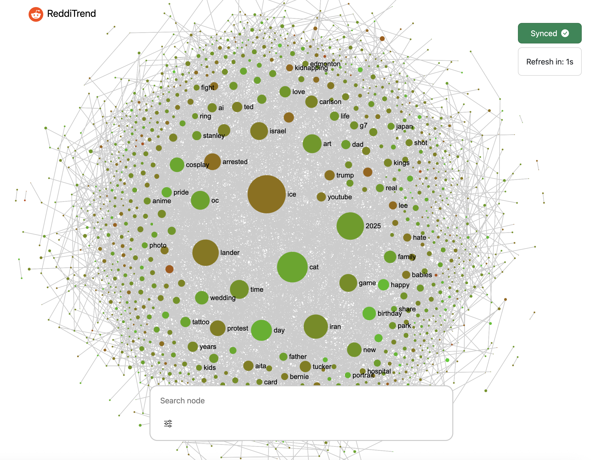
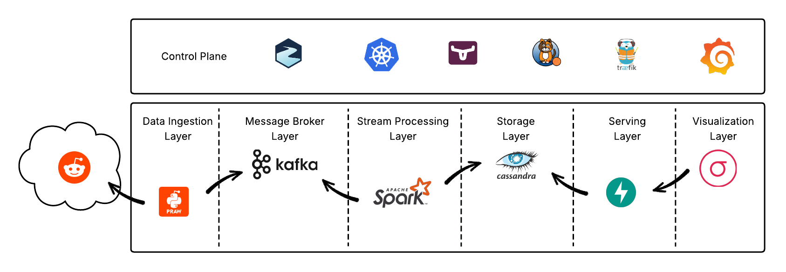

# 📈 ReddiTrend

**Real-time trending topics from Reddit, visualized as an interactive sentiment graph.**

ReddiTrend is a distributed system that continuously monitors Reddit, extracts the most influential topics and their associated sentiment using NLP, and renders everything as a live, interactive knowledge graph in the browser.

---

## ✨ Features

- **Live topic extraction** — Fetches the top 1,000 hot Reddit posts in real time and extracts meaningful keywords using a sentence-transformers model (KeyBERT)
- **Sentiment analysis** — Each topic is scored by sentiment (positive ↔ negative) using VADER analysis of post comments, color-coded green-to-red
- **Interactive graph** — Pan, zoom, search, and explore trending topics. Long-press any node to expand deeper connections
- **Co-occurrence intelligence** — Topics that appear together in the same post become linked. Trending clusters emerge naturally from correlation patterns
- **24-hour moving window** — The graph stays fresh: data older than 24 hours is automatically pruned and decays from the trending view
- **Auto-refresh** — The frontend polls for the latest graph every 60 seconds

## 🖼️ Overview



## ⚙️ Architecture



## 🔄 Pipeline

```
Reddit API  ──►  Kafka  ──►  Spark Streaming  ──►  Cassandra  ──►  FastAPI  ──►  React + Sigma.js
(fetcher)        (topic)      (NLP + graph)       (storage)       (REST API)     (visualization)
```

1. **Reddit Fetcher** — A Python service using PRAW polls the top 1,000 hot Reddit posts every cycle and streams them into a Kafka topic
2. **Spark Consumer** — A Spark Structured Streaming job consumes the topic and processes each post:
   - Extracts keywords from the title using **KeyBERT** (a BERT-based model)
   - Scores sentiment from comments using **VADER**
   - Computes co-occurrence pairs between keywords
3. **Cassandra** — Stores three tables: vertices (keywords → count), vertices_info (per-post metadata + sentiment), and edges (co-occurrence pairs → count)
4. **Spark Batch Jobs** — Two periodic jobs: one precomputes the top trending subgraph, another enforces the 24-hour moving window
5. **FastAPI Backend** — Serves two endpoints: `/api/top-nodes` for the live trending graph, and `/api/expand-node/{node}/{depth}` for exploring deeper connections
6. **React Frontend** — Renders the graph with Sigma.js + Graphology, featuring ForceAtlas2 layout, search, filters, and expand-on-hold

## 🚀 Tech Stack

| Category | Technology |
|---|---|
| **Orchestration** | Kubernetes (Minikube) |
| **Event Streaming** | Kafka via Strimzi operator |
| **Stream Processing** | Apache Spark Structured Streaming (3.5.5) |
| **Batch Processing** | Apache Spark |
| **Database** | Apache Cassandra |
| **API Layer** | FastAPI + Uvicorn |
| **NLP** | KeyBERT (sentence-transformers), VADER |
| **Frontend** | React 19, Sigma.js 3, Graphology, React Bootstrap |
| **Networking** | Calico, Traefik Ingress |
| **Storage** | Longhorn (persistent volumes) |
| **Monitoring** | Prometheus + Grafana |
| **Reddit API** | PRAW |

## 🧪 Quick Start

```bash
# 1. Start Minikube
minikube start -p ReddiTrend-Cluster

# 2. Deploy everything
./deploy.sh

# 3. Port-forward the frontend
kubectl port-forward -n redditrend svc/traefik-web-service 8080:80 -n redditrend
```

> A complete step-by-step guide is available in [`quick-setup.md`](./quick-setup.md).

For individual component setup:
- [Reddit Fetcher](./reddit-fetcher/quick-setup.md)
- [Spark Consumer](./spark-consumer/quick-setup.md)
- [Backend](./backend/quick-setup.md)
- [Metrics & Monitoring](./metrics-server/quick-setup.md)

## 📁 Project Structure

```
ReddiTrend/
├── reddit-fetcher/        # PRAW-based Reddit scraper → Kafka
├── spark-consumer/        # Spark Structured Streaming NLP pipeline
├── spark/                 # Spark batch: top-nodes precomputation
├── spark-window/          # Spark batch: 24h moving window cleanup
├── kafka/                 # Kafka cluster config (Strimzi / KRaft)
├── cassandra/             # Cassandra schema + deployment
├── backend/               # FastAPI REST API
├── redditrend/            # React + Sigma.js frontend
├── monitoring/            # Grafana + Prometheus
├── metrics-server/        # K8s metrics / dashboard
└── deploy.sh              # One-shot cluster bootstrap
```

## 📄 License

This project is licensed under the MIT License — see [`LICENSE`](./LICENSE).
